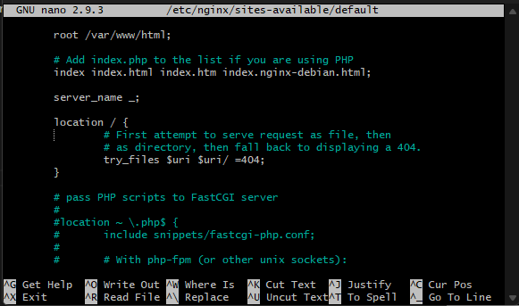
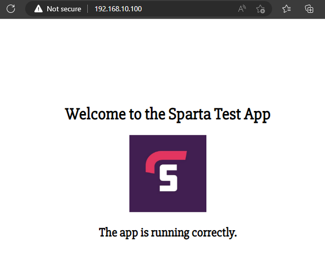
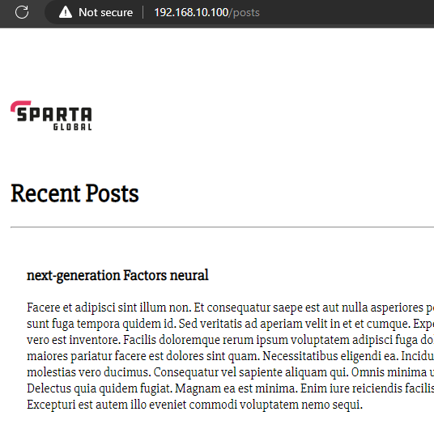
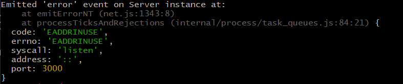

# Devops and Development Environments

## DevOps

### The hook: Video - Google datacenter
* laugh when people say they've reached the pinnacle
* changed cooling system 5 times
Lesson on what's important?
1. maintenance (cooling/security)
2. continual (incremental) improvements & feedback loop

### DevOps pillars
1. ease-of-use
2. flexibility
3. robustness
4. cost

### Risk register
* risk of occurence vs risk/impact to the company

## Development Environments

* Has all the install software they need e.g. Python
* User friendly, fast, robust

## Install Ruby, Vagrant, and VirtualBox

Things to check:
* If you using Windows, turn on 'Virtual Machine Platform' in Windows Features.
* On Windows, you will also need to install Git Bash.
* You need to switch on 'virtualisation' in your BIOS.

### Install VirtualBox

Check with your trainer which version to install, whether v6.1 or 7.0.

### Install Vagrant

Follow instructions on:

https://developer.hashicorp.com/vagrant/downloads

### Install Ruby

Following instructions on:

https://www.ruby-lang.org/en/documentation/installation/

### Setup Visual Studio Code

1. Install Visual Studio Code
2. Setup these extensions:
   * for Ruby
   * for Markdown
   * for HTML CSS support
   * Jupyter (including Call Tags and Slideshow)

## Getting Vagrant running

vagrant init ubuntu/xenial64

vagrant up

vagrant ssh

ls -a

### Setting up your Vagrant VM

#### Update your Ubuntu (without prompting)
sudo apt-get update -y

#### Install the web server (without prompting)
sudo apt-get install nginx -y

#### Start up the web server
sudo systemctl start nginx

Check it is running:
sudo systemctl status nginx

### Configuring your Vagrantfile

After the line in your Vagrantfile `config.vm.box = "ubuntu/xenial64"` add this line: `config.vm.network "private_network", ip: "192.168.10.100"`

If you get an error about unable to check revocation for the certificate, you might also need to add this line:
`config.vm.box_download_insecure = true`

If there an app folder to sync with:
`config.vm.synced_folder "<folder with app>", "<path inside of VM>"`
Example:
`config.vm.synced_folder "app", "/home/vagrant/app"`

Then run this command:
vagrant reload

### Destroying your Vagrant VM

vagrant destroy

### Install bundler & install the gems needed

In the \environment\spec-tests folder, install bundler:
`gem install bundler`

Then run these commands:
`bundler` or `bundle`

If you have installed a newer version of bundler, you can install the version of bundler we need:
`gem install bundler -v 2.2.31`

 force bundler to use the version needed by running this command:
`bundle _2.2.31_ -v`

### Test what is needed for the app

`rake spec`

### Fix the items which are needed by the app

1. Run your VM using vagrant, then ssh into it using the command `vagrant ssh`.
2. Upgrade your Linux packages using `sudo apt-get update -y` and `sudo apt-get upgrade -y`
3. Install the nginx web server using the command `sudo apt install nginx -y`, then run the nginx web server using `sudo systemctl enable nginx`
4. `sudo apt-get install python-software-properties`
5. Download the nodejs version we need: `curl -sL https://deb.nodesource.com/setup_6.x | sudo -E bash -`
6. Install nodejs (it will use the version just downloaded) using the command `sudo apt-get install nodejs -y`
7. Install pm2 using `sudo npm install pm2 -g`
8. Change directory - go into 'app' folder
9. Install the app with `npm install`
10. Run the app with `node app.js`

In your browser, go to 192.168.10.100:3000

Tools used
* app.diagrams.net

### Setting up the reverse proxy

1. This file needs editing within the app VM: `/etc/nginx/sites-available/default`
2. Find the location block with this line: `try_files $uri $uri/ =404;`
3. Replace it with 'proxy_pass http://localhost:3000/;'
4. Restart the nginx service with the command: `sudo service nginx restart' or 'sudo systemctl restart nginx'
5. Run the app using 'node app.js' or 'npm start'
6. If the app is already running you may get an error about the port 3000 already being in use (go to section 'Error: Port 3000 already in use').

If the reverse proxy is working, you will no longer need the port address (3000), and it should look like this when you go to the app's IP address in your browser.

If you go to the /posts section of the app/website, it should look like this:

  
## Troubleshooting

### Problem: No posts are showing on the posts page.

Root problem: The database hasn't been seeded.  You screen will look like this:

Solution: Seed the database using the command `node seeds/seed.js`

Note: You need to be in the `app` folder and see the `seeds` folder before running the command.

If the database has been successfully seeded, your screen will look like this:

  

### Error: Port 3000 already in use

When it happens: You try to start the node js app.

Part of the screen will have this error:

How to fix it: Kill the node process already running (occupying port 3000).
1. See the processes you are running:
  

### Error when trying to search/replace with sed command and forward slashes

Reason for the error: These characters `$.*/[\]^` need to be escaped by putting a backlash before each.

#### Example
You need to do this command in a script:
`sudo sed -i "s/try_files $uri $uri/ =404;/proxy_pass http://localhost:3000/;/" /etc/nginx/sites-available/default`

But you need to put in a back slash before each forward slash and dollar sign in your search and replace strings:
`sudo sed -i "s/try_files \$uri \$uri\/ =404;/proxy_pass http:\/\/localhost:3000\/;/" /etc/nginx/sites-available/default`

  
## Next steps/tasks?

* Automate the startup of the app with Vagrant, by making it run as a background process